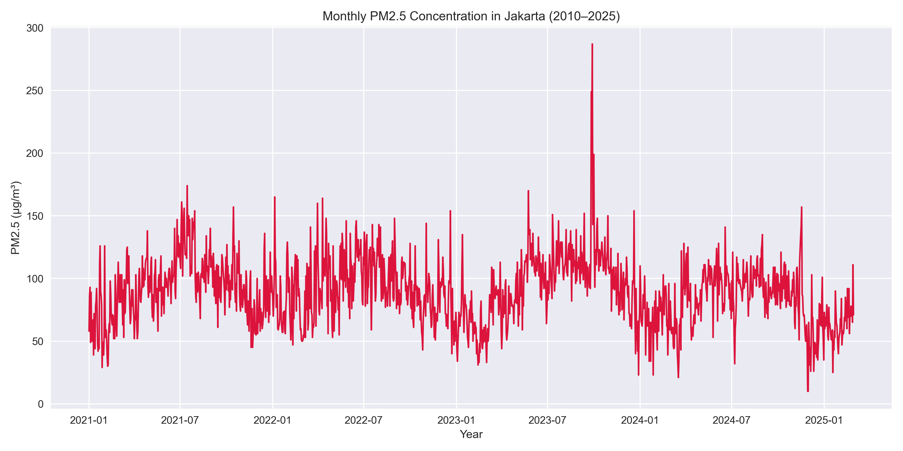
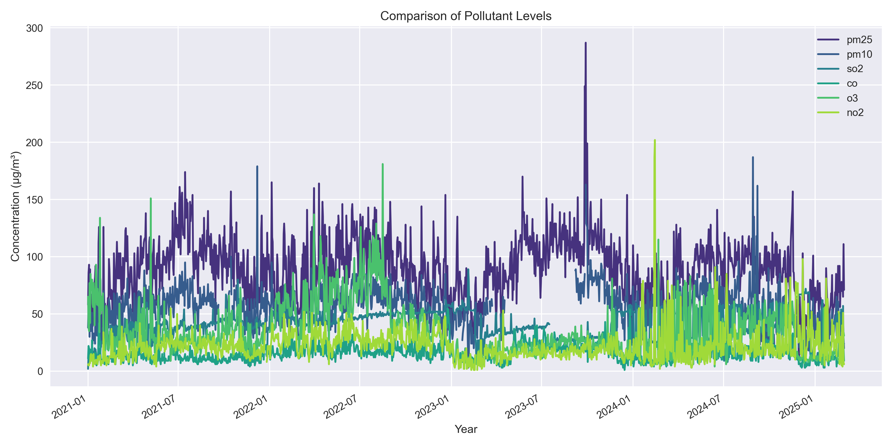
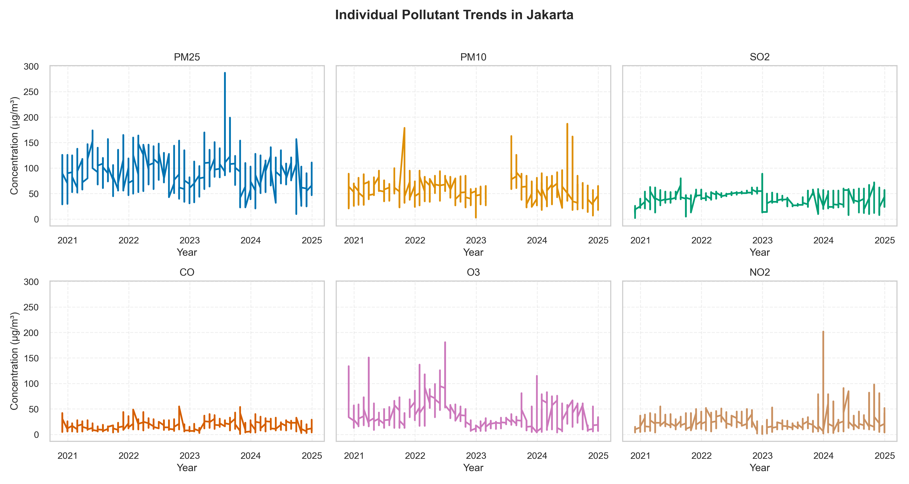

# Jakarta Air Quality Analysis (2010–2025)

---

## Project Overview

Hello, I’m Anastasya, an engineer and researcher with a strong passion for data-driven problem-solving.
With an academic background in Oil and Gas Engineering and hands-on experience in petroleum and petrochemical projects, 
I have worked on initiatives focused on CO₂ emission reduction and decarbonization. These experiences inspired my interest 
in exploring the data analytics side of energy transition and carbon capture technologies to tackle global environmental challenges.

This repository represents my first independent data research project, where I analyze and explore 
Jakarta’s air quality using a data-driven approach. The goal is to uncover pollution trends, emission patterns, and potential 
environmental risks, as well as generate insights that could inform urban policy and environmental management.
Collaborations and discussions are highly welcome - feel free to replicate, adapt, or expand upon this analysis for related research topics.

---

## Background

Jakarta, Indonesia, has been consistently ranked among the most polluted cities in the world. In September 2023, it recorded an alarming 
Air Quality Index (AQI) of 287 µg/m³, making it the most polluted city globally at that time — far exceeding the World Health Organization (WHO) 
threshold for unhealthy air quality. 
Among the pollutants, PM2.5 (particulate matter with a diameter of 2.5 micrometers or smaller) poses the greatest health risk. 
Due to its small size, PM2.5 can penetrate deep into the lungs and even enter the bloodstream, causing respiratory and cardiovascular diseases.
A 2010 study reported that over 57% of Jakarta’s residents suffer from respiratory illnesses directly linked to air pollution, 
including bronchial asthma, bronchopneumonia, and coronary artery disease.

The city’s major pollution sources include vehicular emissions, industrial activities, and open burning of organic waste.
With a population exceeding 11.6 million, Jakarta experiences severe traffic congestion, dominated by motorbikes, cars, 
and diesel-fueled trucks that emit significant amounts of nitrogen dioxide (NO₂) and sulfur dioxide (SO₂).
High concentrations of these gases are typically observed in densely populated and high-traffic areas.

## Research Focus

This project analyzes over a decade of historical air quality data from Jakarta, focusing on six key pollutants:
- PM2.5 (Fine Particulate Matter)
- PM10 (Coarse Particulate Matter)
- SO₂ (Sulfur Dioxide)
- CO (Carbon Monoxide)
- O₃ (Ozone)
- NO₂ (Nitrogen Dioxide)

Using Python and libraries such as Matplotlib, the study applies a data visualization and exploratory analysis approach to examine long-term trends, seasonal variations, and inter-pollutant relationships.
The aim is to generate insights that can support evidence-based environmental policies, public awareness, and sustainable urban development.

---

## Key Insights
- **PM2.5 and PM10** show consistent seasonal peaks during the dry season (June–August).
- **SO₂ and NO₂** concentrations indicate ongoing industrial and vehicular contributions.
- **O₃** levels fluctuate with sunlight intensity, showing photochemical smog activity.
- **CO** correlates with traffic density, especially in high-mobility months.
- The overall **urban AQI** remains above WHO guidelines for much of the year.

---

## Methods
- **Language:** Python  
- **Libraries:** pandas, matplotlib, seaborn, numpy  
- **Analysis:** Descriptive statistics, temporal trend visualization, correlation matrix  

---

## Sustainability Context
This project aims to support **data-driven emission reduction** and **urban energy transition** strategies by:
- Encouraging **renewable-based transport electrification**  
- Improving **industrial emission reporting**  
- Integrating **real-time AQI data** into environmental policymaking  

---

## Visualizations

**Average Monthly PM2.5 Trend**

**Pollutant Comparison**

**Individual Pollutant Trend**

---

## Future Work: Predictive Modeling and Emission Reduction Scenarios

This project will be expanded to include air quality forecasting and scenario-based modeling.
Using machine learning, I plan to predict Jakarta’s pollutant levels for the next decade and 
simulate various environmental interventions such as electric vehicle adoption, carbon capture implementation, and urban green expansion.

These simulations will help visualize how different sustainability strategies could impact Jakarta’s air quality by 2030 and beyond.

---

## Author
**Anastasya Lesnussa**  
B.Eng in Oil & Gas Engineering | Data Analyst in Energy Transition  
🌍 [LinkedIn](https://linkedin.com/in/anastasyalesnussa) 
